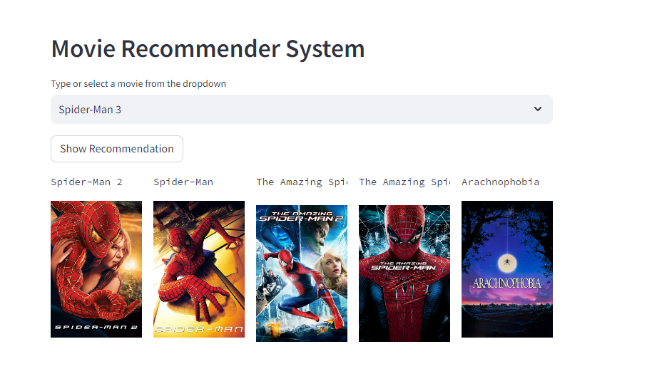

## Simple machine learning movie recommendation systems

#### **Cloning the repository**

```bash
$ git clone https://github.com/happy-kitty0821/MovieRecommendationSystem-AI.git

cd MovieRecommendationSystem-AI/
```

### **creating a python virtual environment**
```python
python -m venv venv
```

### **Activating virtual environment**

#### **For windows**
```powershell
./venv/Scripts/activate
```
**or**

#### **For linux or MacOs**
```bash
source venv/bin/activate
```

### running the Application

```python 
streamlit run app.py
```

#### Demo of the working project

- **Running the application**


- **Web Result**


- **Search View**
